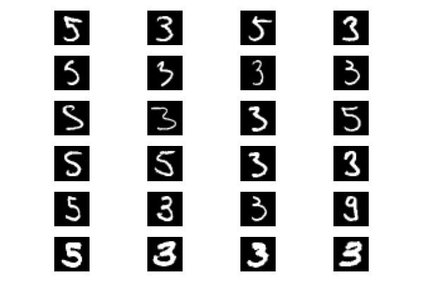
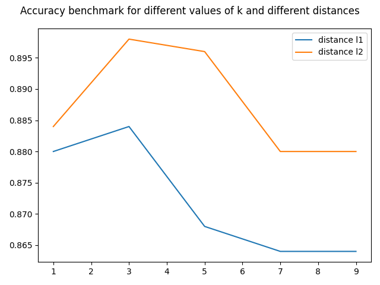

## k-nearest neighbors

Simple classifier implemented using the KNN algorithm on a subset of MNIST's handwritten digit dataset.

Examples of misclassifications, the first image on each row is the test image. The next 3 are the closest images that matched the test image.

Benchmark

